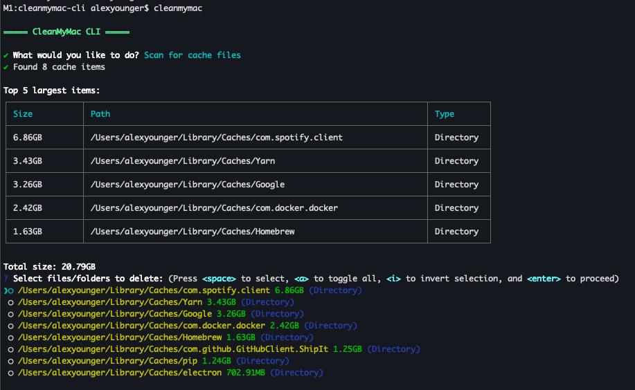

# CleanMyMac CLI

A simple yet powerful command-line interface tool for macOS that helps you clean up your system by identifying and removing unnecessary files. This tool simulates some of the core functionality of CleanMyMac, focusing on cache scanning and large file detection.

## Features

### 🧹 Cache File Scanning
- Automatically scans common macOS cache locations
- Identifies and lists cache files with their sizes
- Allows selective deletion of unnecessary cache files

### 📊 Large File Detection
- Scans user-specified directories for large files and folders
- Identifies items larger than 1GB
- Presents results sorted by size for easy decision making

### 🔍 Interactive Selection
- Choose which files to keep or delete with an interactive checklist
- See detailed information about file sizes in human-readable format
- Get overview statistics of potential space savings

### ⚠️ Safe File Management
- Confirmation prompts before any deletion occurs
- Detailed reporting of deleted files and any errors
- Skip system-critical files through careful directory selection

## Installation

### Prerequisites
- Node.js (v18 or higher)
- npm (v6 or higher)

### Setup
1. Clone this repository:
```bash
git clone https://github.com/AlextheYounga/cleanmymac-cli.git
cd cleanmymac-cli
```

2. Install dependencies:
```bash
npm install
```

## Usage

### Add alias
In ~/.bash_profile or ~/.aliases
```bash
alias cleanmymac="node path/to/cleanmymac-cli/index.js"
```

### Running the Tool
```bash
# Raw
node path/to/cleanmymac-cli/index.js

# With alias 
cleanmymac
```

### Main Menu
The main menu provides the following options:
- **Scan for cache files** - Scans common macOS cache directories
- **Scan for large files (>1GB)** - Scans user-specified directories for large files
- **Exit** - Exits the application

### Scanning Cache Files
When selecting "Scan for cache files", the tool will:
1. Search through common macOS cache locations
2. Display a list of cache files found with their sizes
3. Allow you to select which ones to delete
4. Confirm before deletion

### Finding Large Files
When selecting "Scan for large files", the tool will:
1. Prompt you for a directory to scan (default: ~/Documents)
2. Recursively search for files and folders larger than 1GB
3. Display results sorted by size (largest first)
4. Show a summary table of the top 5 largest items
5. Allow selection of items to delete
6. Confirm before deletion

## Screenshots


## Limitations
- Some system files may be protected by macOS and cannot be deleted
- Scanning very large directories can be time-consuming
- May hit Node memory limits when trying to scan root directory

## Contributing
Contributions are welcome! Please feel free to submit a Pull Request.

## License

This project is licensed under the MIT License - see the LICENSE file for details.

## Disclaimer

This tool is provided as-is with no warranties. Always ensure you have backups before deleting files. The authors are not responsible for any data loss that may occur from using this tool.